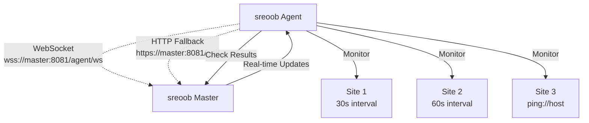

# sreoob Monitoring Agent

[](https://golang.org/dl/)
[](LICENSE)
[](#real-time-synchronization)
[](#cross-compilation)

A lightweight Go-based monitoring agent that connects to a sreoob master instance to monitor websites and services with **real-time synchronization**.

## 📋 Table of Contents

- [Features](#-features)
- [Configuration](#-configuration)
- [Real-time Synchronization](#-real-time-synchronization)
- [Generating API Keys](#-generating-a-secure-api-key)
- [Environment Variables](#-setting-environment-variables)
- [Installation](#-installation)
- [Docker Deployment](#-docker-deployment)
- [Monitoring Behavior](#-monitoring-behavior)
- [Supported Site Types](#-supported-site-types)
- [Logging](#-logging)
- [Security](#-security-considerations)
- [Troubleshooting](#-troubleshooting)
- [Development](#-development)
- [Architecture](#-architecture)

## ✨ Features

- 🔒 **Secure**: Minimal attack surface with only essential dependencies
- ⚡ **Fast**: Written in Go for optimal performance and low resource usage
- 🔄 **Real-time**: WebSocket support for instant updates from master
- 🎯 **Flexible**: Supports HTTP/HTTPS and ping monitoring
- 🌐 **Distributed**: Can be deployed remotely from the master instance
- 🛡️ **Reliable**: Automatic reconnection and graceful error handling
- 📊 **Adaptive**: Sync frequency adapts to the fastest site check interval

## ⚙️ Configuration

The agent is configured using environment variables:

### Required Variables

| Variable | Description | Example |
|----------|-------------|---------|
| `MASTER_FQDN` | Master sreoob instance FQDN | `https://sreoob.example.com` |
| `API_KEY` | Authentication key (≥64 chars) | `abc123...` (64+ characters) |

> **Note**: If no protocol is specified in `MASTER_FQDN`, `https://` is assumed.

### Optional Variables

| Variable | Default | Description |
|----------|---------|-------------|
| `AGENT_PORT` | `8081` | Port for agent-specific traffic |
| `USE_WEBSOCKET` | `true` | Enable WebSocket for real-time updates |
| `LOG_LEVEL` | `info` | Logging level (`debug`, `info`, `warn`, `error`) |

## 🔄 Real-time Synchronization

The agent uses multiple synchronization methods for optimal performance:

### WebSocket (Primary) 🚀

- **Real-time updates**: Instant notification when sites are added/removed from master
- **Persistent connection**: Maintains efficient WebSocket connection to master
- **Automatic fallback**: Falls back to HTTP polling if WebSocket fails

### HTTP Polling (Fallback) 📡

- **Adaptive frequency**: Syncs based on fastest site scan interval (minimum 10s)
- **Smart calculation**: If fastest site checks every 60s → agent syncs every 15s
- **Automatic adjustment**: Sync frequency updates when site intervals change

### Connection Details 🔗

| Connection Type | Endpoint | Purpose |
|----------------|----------|---------|
| **WebSocket** | `wss://master:8081/agent/ws` | Real-time updates, result submission |
| **HTTP API** | `https://master:8081/api/` | Fallback polling, connection testing |

## 🔐 Generating a Secure API Key

The agent requires a minimum **64-character** API key. Here's how to generate one:

### Linux / macOS 🐧 🍎

```bash
# Generate a 64-character random string
API_KEY=$(openssl rand -hex 32)
echo "Generated API Key: $API_KEY"
```

### Windows (PowerShell) 🪟

```powershell
# Generate a 64-character random string
$API_KEY = -join ((1..64) | ForEach {'{0:X}' -f (Get-Random -Max 16)})
Write-Host "Generated API Key: $API_KEY"
```

### Alternative (Python - Any Platform) 🐍

```bash
python3 -c "import secrets; print('Generated API Key:', secrets.token_hex(32))"
```

## 🌍 Setting Environment Variables

### Linux / macOS (Bash/Zsh)

<details>
<summary>Click to expand</summary>

```bash
# Set for current session
export MASTER_FQDN="https://your-sreoob-master.com"
export API_KEY="your-64-character-api-key-here"
export AGENT_PORT="8081"
export USE_WEBSOCKET="true"
export LOG_LEVEL="info"

# Make permanent by adding to ~/.bashrc or ~/.zshrc
echo 'export MASTER_FQDN="https://your-sreoob-master.com"' >> ~/.bashrc
echo 'export API_KEY="your-64-character-api-key-here"' >> ~/.bashrc
echo 'export AGENT_PORT="8081"' >> ~/.bashrc
echo 'export USE_WEBSOCKET="true"' >> ~/.bashrc
echo 'export LOG_LEVEL="info"' >> ~/.bashrc
source ~/.bashrc
```

</details>

### Windows (Command Prompt)

<details>
<summary>Click to expand</summary>

```cmd
REM Set for current session
set MASTER_FQDN=https://your-sreoob-master.com
set API_KEY=your-64-character-api-key-here
set AGENT_PORT=8081
set USE_WEBSOCKET=true
set LOG_LEVEL=info

REM Make permanent (requires admin privileges)
setx MASTER_FQDN "https://your-sreoob-master.com"
setx API_KEY "your-64-character-api-key-here"
setx AGENT_PORT "8081"
setx USE_WEBSOCKET "true"
setx LOG_LEVEL "info"
```

</details>

### Windows (PowerShell)

<details>
<summary>Click to expand</summary>

```powershell
# Set for current session
$env:MASTER_FQDN = "https://your-sreoob-master.com"
$env:API_KEY = "your-64-character-api-key-here"
$env:AGENT_PORT = "8081"
$env:USE_WEBSOCKET = "true"
$env:LOG_LEVEL = "info"

# Make permanent for current user
[Environment]::SetEnvironmentVariable("MASTER_FQDN", "https://your-sreoob-master.com", "User")
[Environment]::SetEnvironmentVariable("API_KEY", "your-64-character-api-key-here", "User")
[Environment]::SetEnvironmentVariable("AGENT_PORT", "8081", "User")
[Environment]::SetEnvironmentVariable("USE_WEBSOCKET", "true", "User")
[Environment]::SetEnvironmentVariable("LOG_LEVEL", "info", "User")
```

</details>

## 📦 Installation

### From Source

1. **Prerequisites**: Ensure you have [Go 1.21+](https://golang.org/dl/) installed
2. **Download**: Clone or download the agent code
3. **Build**: 

```bash
cd agent
go mod tidy
go build -o sreoob-agent
```

### Quick Start 🚀

```bash
# Generate secure API key and run
export MASTER_FQDN="https://your-sreoob-master.com"
export API_KEY=$(openssl rand -hex 32)
./sreoob-agent
```

### Using Environment Files

```bash
# Create .env file
cat > .env << 'EOF'
MASTER_FQDN=https://your-sreoob-master.com
API_KEY=your-64-character-api-key-generated-above
AGENT_PORT=8081
USE_WEBSOCKET=true
LOG_LEVEL=info
EOF

# Load and run
source .env
./sreoob-agent
```

## 🐳 Docker Deployment

### Build and Run

```bash
# Build image
docker build -t sreoob-agent .

# Run container
docker run -d \
  --name sreoob-agent \
  -e MASTER_FQDN=https://your-sreoob-master.com \
  -e API_KEY=your-64-character-api-key-generated-above \
  -e AGENT_PORT=8081 \
  -e USE_WEBSOCKET=true \
  --restart unless-stopped \
  sreoob-agent
```

### Docker Compose

```yaml
version: '3.8'
services:
  sreoob-agent:
    build: .
    restart: unless-stopped
    environment:
      - MASTER_FQDN=https://your-sreoob-master.com
      - API_KEY=your-64-character-api-key
      - AGENT_PORT=8081
      - USE_WEBSOCKET=true
      - LOG_LEVEL=info
```

## 📊 Monitoring Behavior

### Real-time Operation ⚡

- **WebSocket**: Receives instant updates when sites are added/removed
- **Adaptive sync**: HTTP fallback syncs based on fastest site scan interval
- **Result submission**: Sends check results back to master in real-time
- **Auto-recovery**: Automatically reconnects if connections are lost

### Site Monitoring 🎯

- Each site is monitored according to its configured scan interval
- Supports both HTTP/HTTPS and ping monitoring protocols
- Results are immediately submitted to master (WebSocket preferred, HTTP fallback)
- Graceful handling of temporary connection issues

### Performance Optimization 📈

| Scenario | Sync Frequency | Description |
|----------|----------------|-------------|
| Fast sites (10s checks) | Every 10s | Minimum sync interval |
| Normal sites (60s checks) | Every 15s | 4x faster than fastest |
| Slow sites (5m+ checks) | Every 5m | Maximum sync interval |

- **Efficient connections**: Persistent WebSocket with HTTP/2 fallback
- **Minimal resource usage**: Only syncs when needed

## 🌐 Supported Site Types

### HTTP/HTTPS Sites 🌍

```
✅ https://example.com
✅ http://internal-service.local:8080
✅ https://api.service.com/health
```

### Ping Monitoring 🏓

```
✅ ping://example.com
✅ ping://192.168.1.1
✅ ping://internal-host.local
```

## 📝 Logging

The agent provides structured logging with the following levels:

| Level | Description | Example |
|-------|-------------|---------|
| **INFO** | Normal operations | Site monitoring, connections |
| **WARN** | Warning conditions | Fallbacks, retries |
| **ERROR** | Error conditions | Failed checks, connection issues |
| **FATAL** | Critical errors | Configuration errors, startup failures |

### Example Log Output

```log
INFO: SREoob Agent starting - connecting to master at https://sreoob.example.com
INFO: Using custom agent port: 8081
INFO: WebSocket enabled for real-time updates
INFO: Successfully connected to master
INFO: WebSocket connection established
INFO: Starting monitoring for site 'Example Site' (ID: 1) with 30s interval
INFO: Monitoring refresh complete - 2 sites active, sync interval: 7.5s
✅ Example Site: up (0.142s)
❌ Test Site: down (5.001s) - Request failed: context deadline exceeded
INFO: Received site update via WebSocket: 3 sites
```

## 🔒 Security Considerations

- ✅ Always use **HTTPS** for the master FQDN in production
- ✅ Keep API keys **secure** and rotate them regularly
- ✅ Use **dedicated agent port** to isolate traffic
- ✅ Run the agent with **minimal privileges**
- ✅ Consider running in a **container** for additional isolation
- ✅ Monitor agent logs for **security events**
- ✅ WebSocket connections use **same authentication** as HTTP

## 🔧 Troubleshooting

### Connection Issues ❌

<details>
<summary><strong>"Failed to connect to master"</strong></summary>

- ✅ Verify the `MASTER_FQDN` is correct and accessible
- ✅ Check network connectivity
- ✅ Ensure the master instance is running
- ✅ Verify agent port is accessible if custom port is used

</details>

<details>
<summary><strong>"WebSocket connection failed"</strong></summary>

- ✅ Check if master supports WebSocket on agent port
- ✅ Verify firewall allows WebSocket traffic
- ✅ Agent will fall back to HTTP polling automatically

</details>

<details>
<summary><strong>"Configuration error"</strong></summary>

- ✅ Verify all required environment variables are set
- ✅ Check that `MASTER_FQDN` includes the protocol (http/https)
- ✅ Ensure `API_KEY` is at least 64 characters

</details>

### Performance Issues 📊

- 📈 Monitor CPU and memory usage
- 🔍 Check WebSocket connection status in logs
- ⚡ Verify sync frequency adapts to site intervals
- 🚀 Consider using custom agent port for better performance
- 🌐 Monitor network latency to master instance

## 👨‍💻 Development

### Building from Source

```bash
# Download dependencies
go mod tidy

# Build for current platform
go build -o sreoob-agent

# Build with optimizations
go build -ldflags "-s -w" -o sreoob-agent
```

### Running Tests

```bash
go test ./...
go test -v ./...  # Verbose output
go test -race ./...  # Race condition detection
```

### Cross-compilation

```bash
# Linux AMD64
GOOS=linux GOARCH=amd64 go build -o sreoob-agent-linux-amd64

# Windows AMD64
GOOS=windows GOARCH=amd64 go build -o sreoob-agent-windows-amd64.exe

# macOS AMD64 (Intel)
GOOS=darwin GOARCH=amd64 go build -o sreoob-agent-darwin-amd64

# macOS ARM64 (Apple Silicon)
GOOS=darwin GOARCH=arm64 go build -o sreoob-agent-darwin-arm64

# Linux ARM64 (for Raspberry Pi, etc.)
GOOS=linux GOARCH=arm64 go build -o sreoob-agent-linux-arm64
```

### Build Script

```bash
# Build for current platform
./build.sh

# Build for all platforms
./build.sh all
```

## 🏗️ Architecture



### Communication Flow

```
Agent ←→ Master Communication:

WebSocket (Primary):
┌─────────┐     wss://master:8081/agent/ws     ┌────────┐
│  Agent  │ ←─────────────────────────────────→ │ Master │
└─────────┘                                     └────────┘
           ├── Real-time site updates
           ├── Instant result submission  
           └── Ping/pong keepalive

HTTP Fallback:
┌─────────┐     https://master:8081/api/       ┌────────┐
│  Agent  │ ←─────────────────────────────────→ │ Master │
└─────────┘                                     └────────┘
           ├── Site list polling (when WebSocket fails)
           ├── Result submission backup
           └── Connection testing

Monitoring Flow:
1. Agent connects to master via WebSocket + HTTP
2. Receives initial site list
3. Starts monitoring each site per its interval
4. Submits results via WebSocket (or HTTP if WS fails)
5. Receives real-time updates via WebSocket
6. Adapts sync frequency based on site intervals
```

---

## 📄 License

This project is licensed under the MIT License - see the [LICENSE](LICENSE) file for details.

## 🤝 Contributing

1. Fork the repository
2. Create your feature branch (`git checkout -b feature/amazing-feature`)
3. Commit your changes (`git commit -m 'Add some amazing feature'`)
4. Push to the branch (`git push origin feature/amazing-feature`)
5. Open a Pull Request

## 📞 Support

- 📝 **Documentation**: Check this README and inline code comments
- 🐛 **Issues**: Report bugs via GitHub Issues
- 💬 **Discussions**: Use GitHub Discussions for questions
- 🔒 **Security**: Report security issues privately

---

<p align="center">
  <strong>Built with ❤️ using Go</strong><br>
  Fast • Secure • Real-time • Cross-platform
</p> 